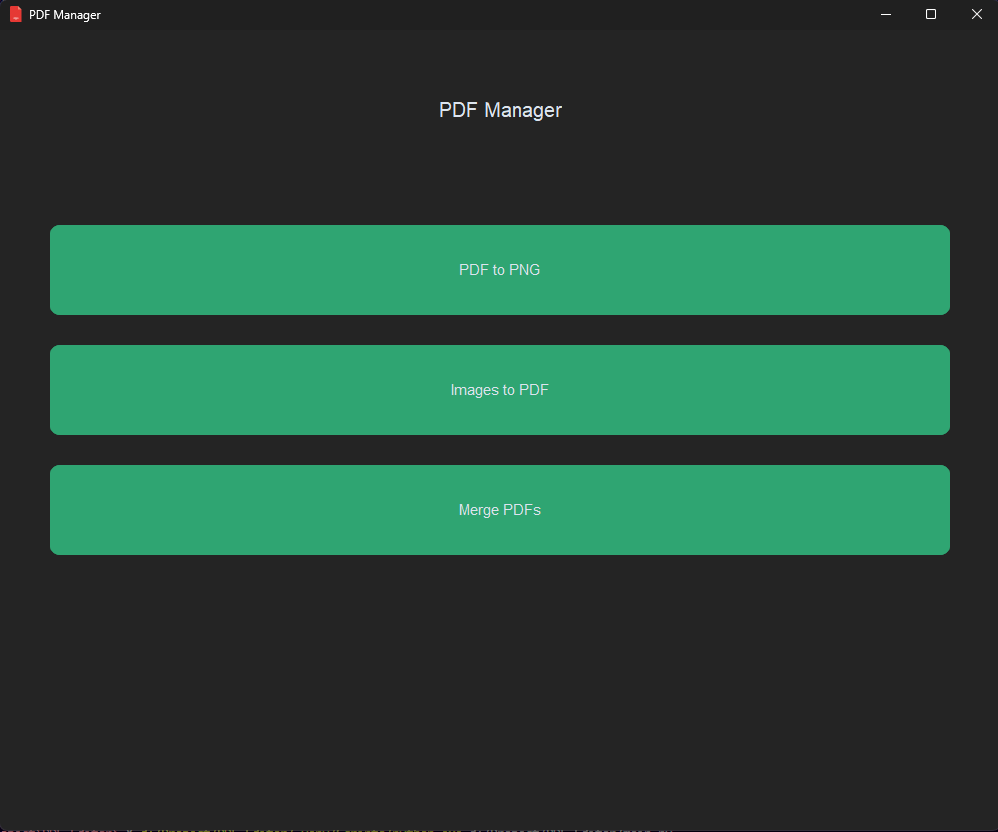

# PDF Manager

PDF Manager is a Python-based desktop application that provides tools for managing PDF files and images. The application allows you to convert PDFs to images, merge multiple PDFs, and convert images into a single PDF.

## Features
- **PDF to PNG Conversion**: Extract pages from a PDF file and save them as PNG images.
- **Images to PDF Conversion**: Combine multiple images into a single PDF file with automated image straightening.
- **Merge PDFs**: Merge multiple PDF files into one consolidated document.

## Installation

1. Clone the repository:
   ```bash
   git clone https://github.com/ironsupr/PDF-Editor.git
   cd pdf-manager
   ```

2. Install the required dependencies:
   ```bash
   pip install -r requirements.txt
   ```

3. Make sure you have [Poppler](https://poppler.freedesktop.org/) installed for PDF to image conversion.

## Usage

1. Run the application:
   ```bash
   python main.py
   ```

2. Use the GUI to:
   - Convert PDFs to PNG images.
   - Convert image folders to a PDF.
   - Merge PDF files.

## File Structure

- **main.py**: The main script for the GUI application.
- **pdf_manager.py**: Contains core functions for handling PDFs and images.
- **output/**: (Generated) Directory for storing converted images and output files.

## Dependencies
- [customtkinter](https://github.com/TomSchimansky/CustomTkinter)
- [pdf2image](https://github.com/Belval/pdf2image)
- [PyPDF2](https://pythonhosted.org/PyPDF2/)
- [OpenCV](https://opencv.org/)
- [Pillow](https://python-pillow.org/)
- [Matplotlib](https://matplotlib.org/)

## Screenshots


## Future Improvements
- Add support for additional image and PDF editing tools.
- Enable batch processing for large files.

## License
This project is licensed under the MIT License. See the LICENSE file for more details.

## Contribution
Contributions are welcome! Feel free to submit a pull request or open an issue for any feature suggestions or bugs.
